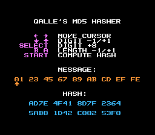

# Qalle's MD5 Hasher
Compute an MD5 hash on the NES. The message can be 0&ndash;9 bytes long.

Table of contents:
* [List of files](#list-of-files)
  * [Text files](#text-files)
  * [Image files](#image-files)
  * [Other files](#other-files)
* [How to use](#how-to-use)
* [Technical information](#technical-information)
* [See also](#see-also)

## List of files

### Text files
* `assemble.sh`: a Linux script that assembles `md5.asm` (don't run it before reading it)
* `md5.asm`: NES source code, assembles with ASM6
* `md5-simple.py`: a simple MD5 implementation in Python

### Image files
* `chr.png`: CHR (graphics) data
* `snap.png`: screenshot

### Other files
These files are gzip compressed; to decompress them, use e.g. `gunzip` on Linux or [7-Zip](https://www.7-zip.org) on Windows.
* `chr.bin.gz`: CHR (graphics) data in NES CHR format
* `md5.nes.gz`: assembled NES program

## How to use
* d-pad left/right: move cursor left/right
* d-pad down/up: decrease/increase digit at cursor by one
* select button: increase digit at cursor by eight
* B button: decrease length of message
* A button: increase length of message
* start button: compute the hash of the current message

## Technical information
* mapper: NROM
* PRG ROM: 16 KiB (only uses the last 2 KiB)
* CHR ROM: 8 KiB (only uses the first 2 KiB)
* name table mirroring: does not matter

## See also
* [this program on itch.io](https://qalle.itch.io/qalles-md5-hasher)
* [MD5 on Wikipedia](https://en.wikipedia.org/wiki/MD5)
